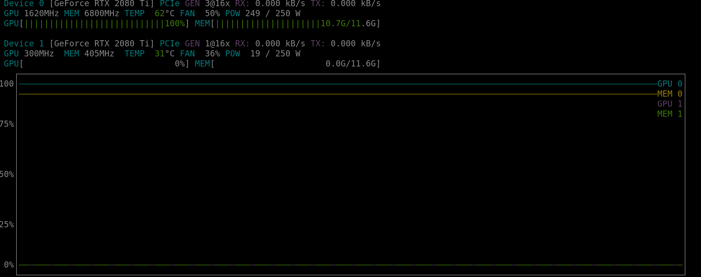

# CTDataset


<p align="center">
  <a href="#code-structure">Code</a> •
  <a href="#how-to">How To Use</a> •
  <a href="#docker">Docker </a> •
</p>


### Code structure
```python
from setuptools import setup
from ctdataset import __version__

setup(
    name='ctdataset',
    version=__version__,
    long_description="",
    packages=[
        "ctdataset",
        "ctdataset.dataset",
    ],
    include_package_data=True,
    url='https://github.com/JeanMaximilienCadic/ctnet',
    license='MIT',
    author='Jean Maximilien Cadic',
    python_requires='>=3.6',
    install_requires=[d.rsplit()[0] for d in open("requirements.txt").readlines()],
    author_email='support@cadic.jp',
    description='GNU Tools for python',
    classifiers=[
        "Programming Language :: Python :: 3.6",
        "License :: OSI Approved :: MIT License",
    ]
)


```

The main execution:
```python
if __name__ == "__main__":
    import argparse
    from ctdataset.dataset import CTDataset
    from torch.utils.data import DataLoader
    from tqdm import tqdm
    parser = argparse.ArgumentParser()
    ########################################### LOADER RELATED #########################################################
    parser.add_argument('ply_root')
    parser.add_argument('--dims', default=(12, 96))
    ################################################ HP ################################################################
    parser.add_argument('--bs', default=10, type=int, help="100,30")
    parser.add_argument('--no_shuffle', action="store_true")
    parser.add_argument('--dense', action="store_true")
    parser.add_argument('--num_workers', default=1, type=int)
    parser.add_argument('--device', default="cuda", type=str)
    parser.add_argument('--no_caching', action="store_true")

    args = parser.parse_args()
    # Loader
    dataset = CTDataset(ply_root=args.ply_root,
                        dims=args.dims,
                        cache=not args.no_caching,
                        limit=100)
    # Model variables
    loader = DataLoader(dataset=dataset,
                        batch_size=args.bs,
                        num_workers=args.num_workers,
                        shuffle=not args.no_shuffle,
                        persistent_workers=True,
                        pin_memory=True,
                        drop_last=True)

    for epoch in range(10):
        for i, (x, y, _, _, _) in tqdm(enumerate(loader), total=len(loader), desc=f">> Epoch {epoch}"):
            x = x.to(args.device)
            y = y.to(args.device)

```
### How to
```bash
# Clone this repository and install the code
$ https://github.com/JeanMaximilienCadic/ctdataset

# Go into the repository
$ cd ctdataset

# Install with python (not recommended)
$ python setup.py install
```
### Docker
```
docker run --gpus all --rm  -v $(pwd):$(pwd) -p 8888:8888 -it tensorflow/tensorflow:latest-gpu-jupyter sh
```

Run a test:
```python
python -m ctdataset
```
